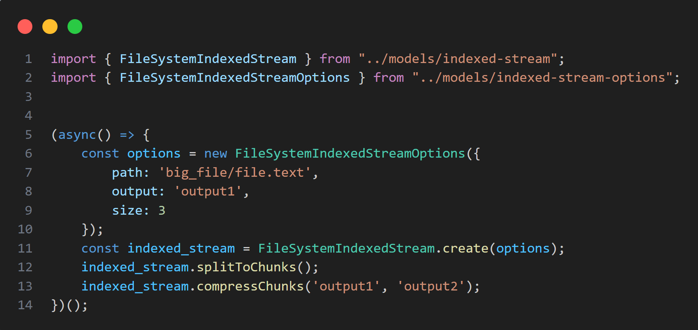

<br/>
<p align="center">
  <a href="https://github.com/tomerzaidler/filesystem-indexed-stream">
  </a>

  <h3 align="center">filesystem-indexed-stream</h3>

  <p align="center">
    A streaming module for dividing large files into smaller chunks and vice versa.
    <br/>
    <br/>
  </p>
</p>

     

## About The Project



Welcome to the FileSystemIndexedStream module, a versatile solution for efficiently handling large files in your projects. This streaming module is designed to seamlessly divide substantial files into smaller, more manageable chunks and, conversely, concatenate smaller chunks to reconstruct the original file.

## Built With

- Node.js
- Typescript

## Getting Started

### Prerequisites

* npm
* Node.js
* Typescript

### Installation

1. Clone the repo

```sh
git clone https://github.com/tomerzaidler/filesystem-indexed-stream
```

2. Install NPM packages

```bash
npm install
```

3. import the desired modules
```typescript
import { FileSystemIndexedStream, FileSystemIndexedStreamOptions } from "filesystem-indexed-stream";
```

## License

Distributed under the MIT License. See [LICENSE](https://github.com/tomerzaidler/filesystem-indexed-stream/blob/main/LICENSE) for more information.

## Authors

 **Tomer Zaidler** - *Senior Backend Software Engineer* - [Tomer Zaidler](https://github.com/tomerzaidler) - **

